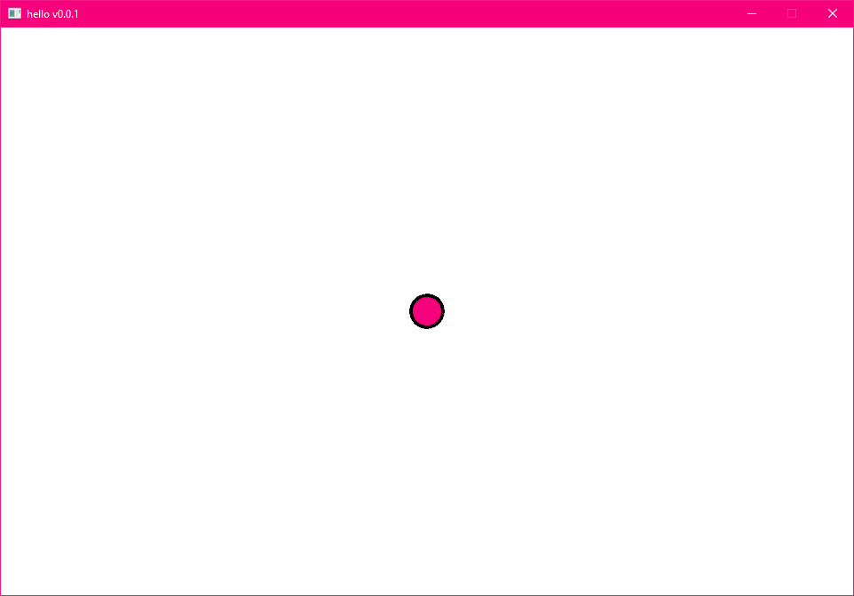
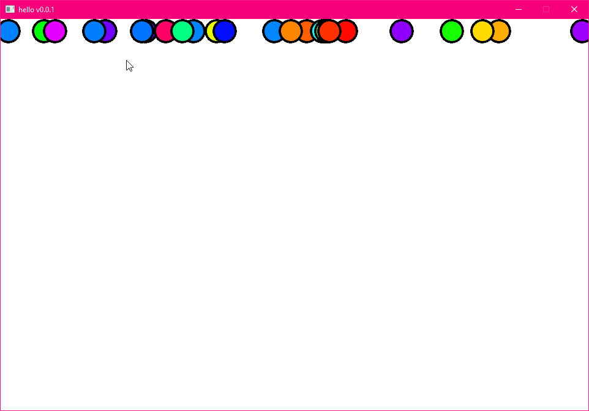
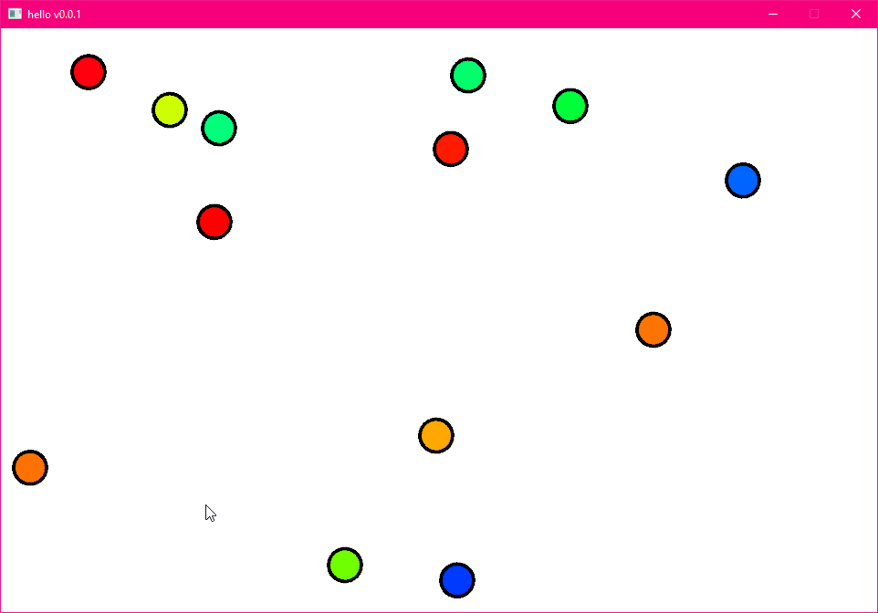
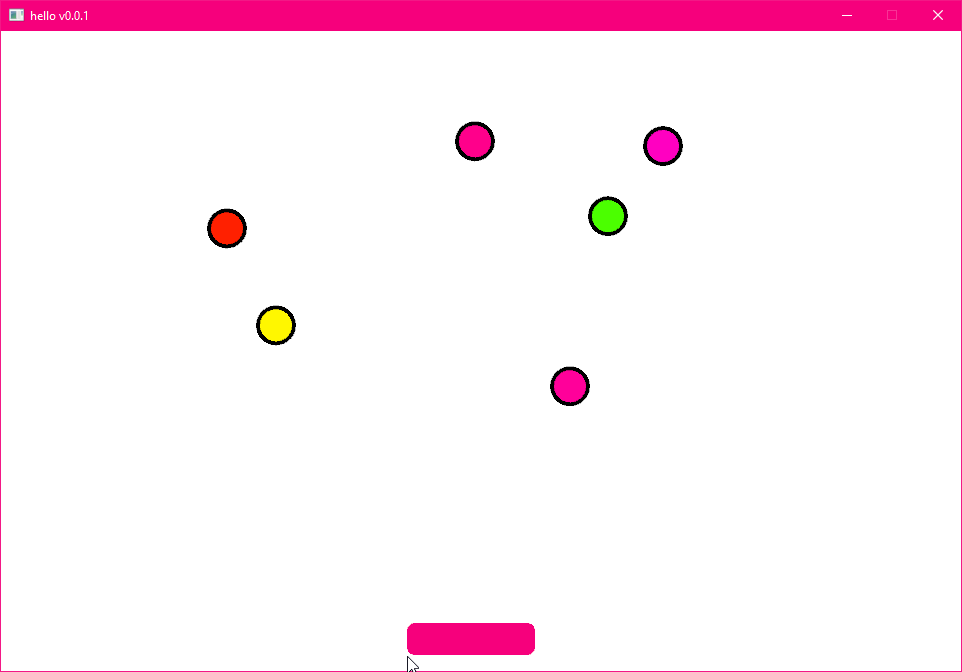
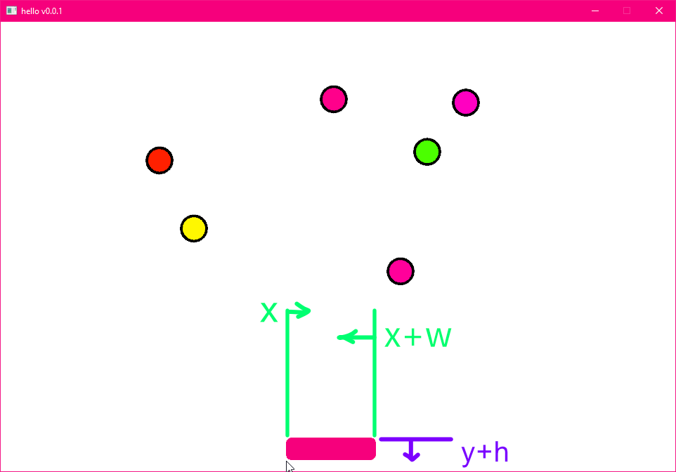
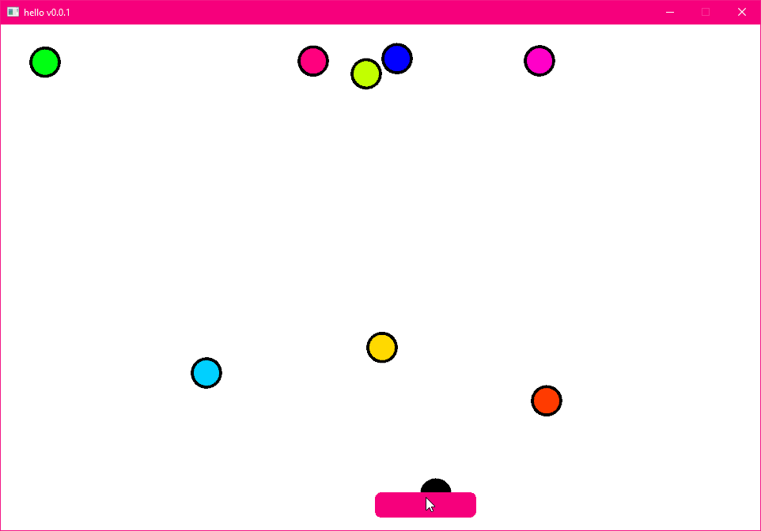

import { Kbd } from 'starlight-kbd/components'
import { Card } from '@astrojs/starlight/components';

:::tip[Outcome / Goals]{icon="puzzle"}
In this tutorial we'll **use the Draw api** to put something on screen.   
We'll also use the **Input Query API** for handling prototype style input.
:::

We'll make a simple game where pressing a key will drop a pebble from a random position at the top of the screen. 
The player will have to catch that pebble with the mouse.

## Play what we're making

- Click on the game area
- Press <Kbd default="Space"/> key to create pebbles. 
- Move your mouse to catch them.

<iframe src="/samples/getting-started/draw-and-input/index.html" width="100%" height="405px" style="overflow:hidden; display:block; position: relative; border:none; height: 405px !important;">
</iframe>

## Save often

When you're changing text in a code file, save often!

As a general rule, save frequently to avoid losing changes you were making, regardless of the tool you're using or what you're editing.

## Trust the process

As we go through and learn to make games, **trust the process**, some things will become clearer as you go on!

**Perserverence** is a lot more important than it may seem. Computers can be fickle and annoying! 

Don't be discouraged with errors, mistakes, or understanding things. That's **how we learn**. Take breaks, ask for help, and keep at it. You will continue to level up! 

## Preparation 

We'll continue from our empty project we created, and make it even emptier. We'll take away the logo and the color changing background!

You should think of code as a **stretchy, squishy, malleable, bendable tool** that you shape to **achieve a goal**. It's not rigid or fixed in place.
We're going to treat code as a playful place, a tool to sketch and scribble, to explore. Deleting and rearranging and reshaping code is a big part of programming.

To get comfortable with that, we'll start by deleting stuff instead of adding stuff!

:::tip[Do this!]{icon="seti:todo"}
**Remove all of these highlighted lines** from your `game.wren` file.
:::

```diff lang=js
class Game is Ready {

- var logo = Entity.none

  construct ready() {

    super("ready! %(width) x %(height) @ %(scale)x")

-   logo = Entity.create(world)
-   Transform.create(logo)
-   Sprite.create(logo, Assets.material("luxe: material/logo"), 128, 128)

  } //ready

  tick(delta: Num) {

-   Transform.set_pos(logo, mouse.x, mouse.y)

    if(Input.key_state_released(Key.escape)) {
      IO.shutdown()
    }

-   color.r = color.g = color.b = (IO.timestamp()/40 % 0.15)

  } //tick

} //Game
```

## Imports

When you want to use a tool (an API) in your wren code, you need to **import** it first.   
If you look at the top of your `game.wren` file, you'll find a bunch of these already.
We're going to add one, since we want to use the `Color` tool. 

:::tip[Do this!]{icon="seti:todo"}
Add this line to the top of your `game.wren` file, after the rest.
:::

```js
import "luxe: color" for Color
```

## Background color

It only takes one new line to change the background color.
Our project outline has created a `color` we can set to change it.

Add the highlighted line to your code, so it looks like this `ready` function. 
When you have **run the game** again.

```diff lang=js
class Game is Ready {

  construct ready() {

    super("ready! %(width) x %(height) @ %(scale)x")

+   color = Color.white

  } //ready

  tick(delta: Num) {

    if(Input.key_state_released(Key.escape)) {
      IO.shutdown()
    }

  } //tick

} //Game
```

:::note[Experiment]{icon="random"}
If you typed `Color.` you should have seen a list of options pop up.
Play around with the different preset colors, or your own, running the game each time to see it change.
:::

## Hello code?

This won't be an in depth programming tutorial, we're focused on learning luxe, but we can cover some basics below. Feel free to skip these!

To start, we'll introduce comments. These are like notes you leave in the code for yourself and others to read to help understand the logic.
Whenever you add two forward slashes `//` the rest of the line becomes a comment.

This is also handy if you have some code you want to "turn off" quickly to experiment. Just comment it out!

```js
// This is a comment! 
// They don't impact the logic
result = 1 + 2
// and are for the person reading the code!
code()
// The line below is not used right now
// code()
```

## Functions: what are they?

**A function is a chunk of code we can give a name.** 
Once you have one, you can 'call it' by name. 

```js
//make a new function called say_hello
say_hello() {
  //chunk of code goes here, in between these braces { ... }
}
```
Functions can also accept values to work with. Let's think about a function from a calculator, that adds two numbers together. We need two numbers!

```js
add(a, b) {
  return a + b
}
```

Our hello function doesn't need any values, that's why it has `()` after the name! We could also make `say_hello(name)` to accept someone's name to say hello to.

To call our function, we use it's name, and use `( )` to send values in. We can put one line after the other:

```js
result = add(1, 3) //4
result = add(6, 2) //8
```

Notice how we had a small chunk of code, but can be used with any numbers! It's reusable.

#### Code as a hallway 

As a simple way of understanding the flow of logic through code, let's simplify and reframe it.

Imagine a long hallway, with doors on one side.  

**Each door is a function call**. As the code walks down each line of code, it moves down the hallway.  
But, every time it sees a function name that we call, it will **enter the door**. 

It will come out the door when that function is finished - usually via `return`, or when it reaches the end of the chunk, and continue down to the next line of code. 

## Variables: what are they?

Our game is going to need to keep track of some things, so we need a place to store them. If we want to store something, we store it in what we call a 'variable'. 

A variable is **a container for a value**. 

We can give them a name, and they're like slots that we create using `var`, which is short for variable!

We can have variables for our class, or inside each function.

## API: what does that mean?

Officially, it stands for "Application Programming Interface". That's a fancy way of saying "functions we call to do stuff".

We're the programmer, and we're talking to the application! The way we communicate is through an interace. Like a user interface, this is a code interface.

The API is a tool we use to call functions, e.g the `Transform` system provides a `Transform API` to do transform related stuff.

So any time you see API, you can say tool.

## Classes: what are they?

**A class is a container of variables and functions.**

Inside `game.wren` you'll find `class Game`. It holds the logic (functions) and data (variables) for our game.

You can make multiple copies of a class to have distinct 'instances' of it. We'll see that later with the pebbles, each instance has it's own position + color on screen.

!!! note "Wren calls a function inside of a class **a method**! They mean the same thing."

## Adding Game variables

We will need some variables for our game, so we create them inside the game class.
These must be before anything else in the class. So they go after `class Game is Ready {`, and before any other code.

This is what they look like:

```js
var name: Type = value
```

The type is optional, as it can assume the type of a lot of the time. For example, `var number = 3` will show up as `var number: Num = 3` with what is called an "inlay hint" telling you it knows that number is well, a number!

:::note
Variables ***must*** be set to _some_ value! When you don't have a value yet, you can use `null` which means 'no value'
:::

We're going to add these:

- A list called `pebbles`. We use `[]` to make an empty list.
- A random number generator, for picking random numbers
- A drawing context to draw into.

:::tip[Do this]{icon="seti:todo"}
Inside the top of our class, add the highlighted lines!
:::

```diff lang=js
class Game is Ready {

+ //A list of pebbles on screen
+ var pebbles: List = []
+ //Our drawing context
+ var draw: Draw = null 
+ //A random number generator
+ var random = Random.new()

  construct ready() {
```

#### Import random
Before this code will run, we need to import the random module from Wren. 
It works a little different, but add this line at the top of your file like we did with Color.

:::tip[Do this]{icon="seti:todo"}
`import "random" for Random`
:::

## The `Draw` tool

With luxe, there are a bunch of tools and services available to quickly explore ideas and try things out. 

One of those, is called `Draw`, it provides shape drawing, text drawing and more. It can be used for debug visualization, for whole games, and for immediate or cached rendering.

## Creating a `Draw` context

A context is like a canvas, it remembers what you're _busy_ drawing, and when you're done you can commit the changes. It won't display the work in progress part without the commit. 

To create a draw canvas, we'll have to ask the world for a render set - something you'll learn more about in future - but for now, this is how you do it.

:::tip[Do this]{icon="seti:todo"}
Add a line that initializes our draw variable, to a new `Draw` context.
:::

```diff lang=js
  construct ready() {

    super("ready! %(width) x %(height) @ %(scale)x")

    color = Color.white

+   draw = Draw.create(World.render_set(world))

  } //ready
```

## The `tick` function

The `tick` function in our class is called once every frame as the game runs. In here, we can do things like, draw our pebbles, check if they went off screen or hit the player, and check if there was any input.

To **explore** this, let's draw a pebble in the middle of the screen, we're sketching.
Copy this small bit of code into your Game class, inside the `tick` function, at the beginning of the function.

```diff lang=js
  tick(delta: Num) {

+   var x = width / 2
+   var y = height / 2
+   var depth = 0
+   var radius = 16
+   var smooth = 6
+ 
+   Draw.circle(draw, x, y, depth, radius+4, smooth, Color.black)
+   Draw.circle(draw, x, y, depth, radius, smooth, Color.pink)
+   Draw.commit(draw)

    if(Input.key_state_released(Key.escape)) {
      IO.shutdown()
    }

  } //tick
```



:::note[ideas to try]{icon="random"}
- Try using `mouse.x` and `mouse.y` as the x and y values.   
- What happens if you comment out the commit line? 
    - like this: ` // Draw.commit(draw) `
:::

:::tip[Do this]{icon="seti:todo"}
We can now delete that temporary code we added, as we're done exploring and sketching!
:::

## Coordinate spaces

Since we're making a 2D game, we're working in 2D world space. 

This is similar to math from early in school, where we have an X axis which is our horizontal direction, and a Y axis for the vertical direction.

In luxe the 2D world space is based on the cartesian system, which just means the origin (0, 0) is bottom left, and x increases to the right, y increases upward.
Negative x would be to the left of that, and negative y would be downward from there.

Bottom Left Origin, Y+ up!

## The game code

To start with our game code, we'll "block out" some placeholder code.
This is our goal:

- Have an empty `create_pebble` and `update_pebbles` function
- Have an empty `update_player` function
- Check if the player pressed the <Kbd default="Space"/> key, and call `create_pebble()`
- Call `update_pebbles` and `update_player` from our tick function so they happen every update
- Commit our Draw context each frame

:::tip[Do this]{icon = "seti:todo"}
Add the highlighted code changes inside `tick`
:::

```diff lang=js
  tick(delta: Num) {

+   if(Input.key_state_released(Key.space)) {
+     create_pebble()
+   }
+
+   update_pebbles(delta)
+   update_player()
+
+   Draw.commit(draw)

    if(Input.key_state_released(Key.escape)) {
      IO.shutdown()
    }

  } //tick
```

:::tip[Do this]{icon = "seti:todo"}
Add the highlighted code changes **before** `tick`
:::

```diff lang=js
+ create_pebble() {}
+
+ update_pebbles(delta: Num) {}
+
+ update_player() {}

tick(delta: Num) {
...
```


## Creating a pebble

Since we're making a small game in one file, we can use a local class in the same file to represent a pebble. A pebble is just a few values for now, so just above our game class, we'll add a pebble class:

```diff lang=js
+class Pebble {
+  var x = 0
+  var y = 0
+  var speed = 20
+  var color = Color.pink
+  var active = true
+  construct new() {}
+}

class Game is Ready {

```

Another tool we have in luxe, is the `Log.print()` API, which allows to write information into the log window (and file). This can be very handy for debugging values and figuring out what's happening in our code.

:::note
Using `%( )` we can insert variables into a string to see their contents. This is called string interpolation.
:::

Let's fill in the blank `create_pebble()` function we made! 

:::tip[Do this]{icon = "seti:todo"}
Add the highlighted code changes
:::

```diff lang=js
create_pebble() {

+  var pebble = Pebble.new()
+  
+  // set it up using a random color, 
+  // and a random position on the top of the screen
+  pebble.color = Color.color_from_hue(random.float())
+  pebble.speed = random.int(20, 150)
+  pebble.x = random.int(width)
+  pebble.y = height - 8
+
+  // add to the list of pebbles
+  pebbles.add(pebble)
+
+ Log.print("creating a pebble at `%(pebble.x) , %(pebble.y)`...")

} //create_pebble
```

## For loops: what are they?

Often in our code, we might want to do the same thing a number of times. This is called a loop. The first kind we'll learn is called a 'for' loop.
We can loop over a range of values, looping 10 times. The chunk of code inside the `{ }` will run 10 times!

```js
for(counter in 0 ... 10) {
  Log.print("counter is %(counter)")
}
```

We can also loop over the contents of a list (or other containers). That looks like this and we'll see it when drawing our list of pebbles.

```js
for(item in container) {
  //use item
}
```

## Drawing the pebbles

If we ran that code, and press space bar, we'd see the log message but no pebbles show on screen yet. 
Inside `update_pebbles` we'll add the code to draw the pebbles from our list.

:::tip[Do this]{icon = "seti:todo"}
Add the highlighted code changes
:::

```diff lang=js
update_pebbles(delta: Num) {

+  var depth = 0
+  var radius = 16
+  var smooth = 6
+ 
+  for(pebble: Pebble in pebbles) {
+    Draw.circle(draw, pebble.x, pebble.y, depth, radius+4, smooth, Color.black)
+    Draw.circle(draw, pebble.x, pebble.y, depth, radius, smooth, pebble.color)
+  }

} //update_pebbles
```

If you run the game, and hit <Kbd default="Space"/> a bunch of times, it should look something like this:



## Moving the pebbles

Now we can update our pebbles to fall downward. 

To do this, we'll move the y position of our pebble every update, by `pebble.speed` amount. 

:::note[Delta time?? A brief detour...]{icon="puzzle"}
When we do `y = y - speed` we are changing the y value in world units. 
If `y` is `100` and `speed` is `1`, after one frame, we are at 99. Then 98, and so on.

What happens if the game runs at 30 frames **per second** instead of 60 *frames per second*? Or 120, 240...   
In one second, we moved:   
- `30 frames * 1 speed = 30 units`...     
- `60 frames * 1 speed = 60 units`...   

We don't actually want this to be different, we are likely trying to move at 1 unit per second!

To do that, we use that `delta` variable we handed to our function.    
If we multiply `speed` by `delta` time, we get `units per second` instead of just `units`!   

Here's a more [detailed video on the concept](https://www.youtube.com/watch?v=yGhfUcPjXuE) if curious.
:::

:::tip[Do this]{icon = "seti:todo"}
Add the highlighted code changes
:::

```diff lang=js
update_pebbles(delta: Num) {

  var depth = 0
  var radius = 16
  var smooth = 6

  for(pebble: Pebble in pebbles) {

+   pebble.y = pebble.y - (pebble.speed * delta)

    Draw.circle(draw, pebble.x, pebble.y, depth, radius+4, smooth, Color.black)
    Draw.circle(draw, pebble.x, pebble.y, depth, radius, smooth, pebble.color)
  }

}
```

And now the pebbles fall!



## Player paddle

The player will be a rectangle near the bottom of the screen, and will try to catch the falling pebbles with their paddle. Let's start with drawing the player.

:::tip[Do this]{icon = "seti:todo"}
Add the highlighted code changes
:::

```diff lang=js
update_player() {

+  //player width and height
+  var w = 128
+  var h = 32
+ 
+  //centered on the mouse
+  var x = (mouse.x - w/2)
+  //stop at the right edge of the window
+  x = x.min(width - w)
+  //stop at the left edge of the window
+  x = x.max(0)
+ 
+  var y = 16
+  var depth = 0
+  var angle = 0
+  var radius = [8,8,8,8]
+  var smooth = [4,4,4,4]
+
+  Draw.quad_detailed(draw, x, y, depth, w, h, angle, radius, smooth, Color.pink)

} //update_player
```



## Player collision

Nothing happens when the pebbles hit the player, so we'll have to add a check for that. We're going to keep it really simple and do basic checks to see if the pebble would be overlapping with the player.

Here's how we'll approach it:

- If the `pebble x > player x`
- and `pebble x < player x + player width`
- we know that the pebble is in line with the player horizontally.
- Now we just need to know if the `pebble y < player y + player height`



:::tip[Do this]{icon = "seti:todo"}
Add the highlighted code changes **at the end of update player**
:::
```diff lang=js
update_player() {

  ... //player drawing

+  for(pebble: Pebble in pebbles) {
+
+    var inside_x = pebble.x >= x && pebble.x <= x + w
+    var inside_y = pebble.y <= y + h
+    var was_collected = pebble.active && inside_x && inside_y
+
+    if(was_collected) {
+      pebble.color = Color.black
+      pebble.active = false
+    }
+
+  } //for each pebble

} //update_player
```

And with that, we can see the pebbles turn black when we collect them. Next we'll clean up pebbles we've collected or that have hit the ground below the player.



## Pebble cleanup

We can easily tell when a pebble has been missed by using `inside_y` when `inside_x` is false. When that happens, we'll turn the pebble white instead of black.

And, when any pebble hits the edge of the screen, we'll remove it from the game. Pay attention to the braces!

:::tip[Do this]{icon = "seti:todo"}
Add the highlighted code changes
:::

```diff lang=js
update_player() {

  ... //player drawing

+  var to_remove = []
  for(pebble: Pebble in pebbles) {

    var inside_x = pebble.x >= x && pebble.x <= x + w
    var inside_y = pebble.y <= y + h
    var was_collected = pebble.active && inside_x && inside_y 
+    var was_missed = pebble.active && inside_x == false && inside_y == true
+    var off_screen = pebble.y < -16

    if(was_collected) {
      pebble.color = Color.black
      pebble.active = false
    }

+   if(was_missed) {
+     pebble.color = Color.white
+     pebble.active = false
+   } else if(off_screen) {
+     to_remove.add(pebble)
+   }
    
  } //for each pebble

} //update_player
```

And one more step: actually remove the pebbles from the pebbles list.
We have to do this after, because during the loop, we don't want to change the list out from underneath us.  

:::tip[Do this]{icon = "seti:todo"}
Add the highlighted code changes **after the for loop**
:::


```diff lang=js
update_player() {

  ... //player drawing
  var to_remove = []
  for(pebble: Pebble in pebbles) {
    
    ...

  } //for each pebble

+  for(pebble: Pebble in to_remove) {
+    pebbles.remove(pebble)
+  }

} //update_player
```

## Try this on your own


<Card title="Add score" icon="up-arrow">
Add a `score` variable to the game class, add `1` to it each time a pebble is collected. Display the score using `Draw.text` and `Asset.font("luxe: font/lato")`.
</Card>

<Card title="Add pause" icon="seti:lock">
Add a `var paused = false` boolean. This can stop the pebbles from moving and pause the game e.g `if(paused) return`. You can stop the player moving and display the paused state on screen.
</Card>

<Card title="Add game over" icon="moon">
Add a losing condition, like if you have 5 lives and each time you miss, you lose one. When you have 0, display a game over message. You'll probably want to want make <Kbd default="Space"/> key restart the game, which will require resetting the state and `pebbles.clear()` 
</Card>

<Card title="Add win state" icon="star">
Add a win condition, like if you collect 20 pebbles or survive for a certain amount of time. You can use `IO.timestamp()` to get a time in seconds and display it (once at the beginning of the game and then `now - start`)
</Card>

<Card title="Automatic pebbles" icon="down-arrow">
Try making a `var timer = 0` and `if(timer_ready) { create_pebble() }` with a random time value each time. The random time can get faster the more you play. 
</Card>

## Full code 

```js
import "luxe: draw" for Draw, PathStyle
import "luxe: world" for World, TextAlign
import "luxe: color" for Color
import "luxe: input" for Input, Key
import "luxe: asset" for Asset
import "luxe: io" for IO
import "random" for Random

import "outline/ready" for Ready

class Pebble {
  var x = 0
  var y = 0
  var speed = 10
  var color = Color.pink
  var active = true
  construct new() {}
}

class Game is Ready {

  //A list of pebbles on screen
  var pebbles: List = []
  //Our drawing context
  var draw: Draw = null 
  //A random number generator
  var random = Random.new()

  construct ready() {

    super("ready! %(width) x %(height) @ %(scale)x")

    color = Color.white

    draw = Draw.create(World.render_set(world))

  } //ready

  create_pebble() {

    var pebble = Pebble.new()
    
    //set it up using a random color, 
    //and a random position on the top of the screen
    pebble.color = Color.color_from_hue(random.float())
    pebble.speed = random.int(20, 150)
    pebble.x = random.int(width)
    pebble.y = height - 20

    //add to the list of pebbles
    pebbles.add(pebble)

    Log.print("creating a pebble at `%(pebble.x) , %(pebble.y)`...")

  } //create_pebble

  update_pebbles(delta: Num) {

    var depth = 0
    var radius = 16
    var smooth = 6

    for(pebble: Pebble in pebbles) {

      pebble.y = pebble.y - (pebble.speed * delta)

      Draw.circle(draw, pebble.x, pebble.y, depth, radius+4, smooth, Color.black)
      Draw.circle(draw, pebble.x, pebble.y, depth, radius, smooth, pebble.color)
    }

  } //update_pebbles

  update_player() {

    //player width and height
    var w = 128
    var h = 32

    //centered on the mouse
    var x = (mouse.x - w/2)
    //stop at the right edge of the window
    x = x.min(width - w)
    //stop at the left edge of the window
    x = x.max(0)

    var y = 16
    var depth = 0
    var angle = 0
    var radius = [8,8,8,8]
    var smooth = [4,4,4,4]

    Draw.quad_detailed(draw, x, y, depth, w, h, angle, radius, smooth, Color.pink)

    var to_remove = []
    for(pebble: Pebble in pebbles) {

      var inside_x = pebble.x >= x && pebble.x <= x + w
      var inside_y = pebble.y <= y + h
      var was_collected = pebble.active && inside_x && inside_y 
      var was_missed = pebble.active && inside_x == false && inside_y == true
      var off_screen = pebble.y < -16

      if(was_collected) {
        pebble.color = Color.black
        pebble.active = false
      } else if(was_missed) {
        pebble.color = Color.white
        pebble.active = false
      } else if(off_screen) {
        to_remove.add(pebble)
      }
      
    }

    for(pebble: Pebble in to_remove) {
      pebbles.remove(pebble)
    }

  } //update_player

  tick(delta: Num) {

    if(Input.key_state_released(Key.space)) {
      create_pebble()
    }

    update_pebbles(delta)
    update_player()

    Draw.commit(draw)

    if(Input.key_state_released(Key.escape)) {
      IO.shutdown()
    }

  } //tick

} //Game
```