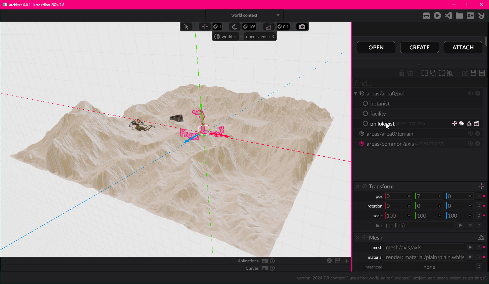

Below we'll briefly cover some concepts you need to get started with luxe.   
As you go further into the guide, all of the concepts will be expanded in detail. 

## World
In luxe, _things_ in your game are represented inside of a **world**.   
A player character, level elements, UI elements, all of these typically exist in a world. 

The world gives you the tools to manage your _things_, and lets you create spaces where your game can happen. You also often have more than one world, like a _UI world_ and a _game world_. 

## Entity
In luxe we call a _thing_ an **entity**.   
Entities are the things that exist in a `World`, like the player or even a menu item.   

An `Entity` is how we talk about a unique _thing_, which makes it the basic building block of making games in luxe!   

## Modifiers
An entity just exists, it can't do anything yet.   
To make an entity do something, we attach **modifiers** to it!   
A modifier _describes_ something you want the entity to be able to do.

If you want your entity to look like a triangle, you attach a modifier to describe that. If you want it to bounce around with some physics too, another modifier is added.

This allows an entity to change at any time, which is very flexible. What it looks like, how it behaves, and _what it actually is_ can change during the game, just by attaching and detaching modifiers. 

## Systems
Systems are what power the modifiers.   
A modifier is added to an entity through a **world system**. 

When you talk about a modifier, you talk to the system that gives it to you. A modifier describes what you want, but the system is what actually makes it happen. 

For example, attaching a `Transform` gives an entity a position in a world. You ask the `Transform` system to attach it, and then you can ask the system to move it around.

!!! summary "Entity based design"
    This may seem familiar, as there are many different varieties (and names) for this concept! The concept has been around for a very long time and are really common in games.

## Services
Some systems exist at a lower level, powering everything, and some exist outside the world at a higher level.    

We call these systems **a service API**.

These are systems that serve a general need beneath the other systems. For example, rendering (drawing things) is a system that acts as a service. It is used by higher level world systems to provide your game with drawing. The random number generator, is also a service API.

## Modules

luxe is designed as a rich set of systems - **ready to make games** - but it couldn't possibly provide _all_ systems that _all_ different types of games may need without becoming too big and unfocused.

With luxe, **modules** solve this by providing a way for you to expand the tools, systems and services that are available to you as a user. 

luxe is designed for modules to serve this need, which makes them a fundamental part of using luxe. In fact, the luxe API itself is a module too!    

## Code vs Editor workflow

**Luxe isn't centered around the editor interface.**

With luxe, if you prefer working through code only, **you can**. 
 
The code focused workflow is complemented by the editor tools.   
They help you create assets that would be faster to create in a tool, but is optional.

The same will eventually be true for editor focused workflows. **Right now the engine leans a little toward code focused**, because the editor is a work in progress and higher level modules which provide those workflows are being made now. In the future it would be possible to work only from the editor and make a wide range of content without opening the code.
