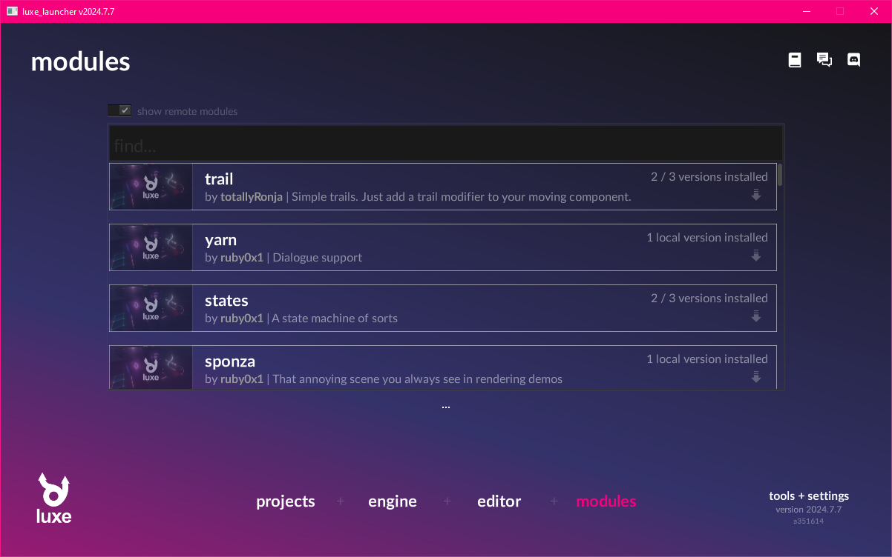
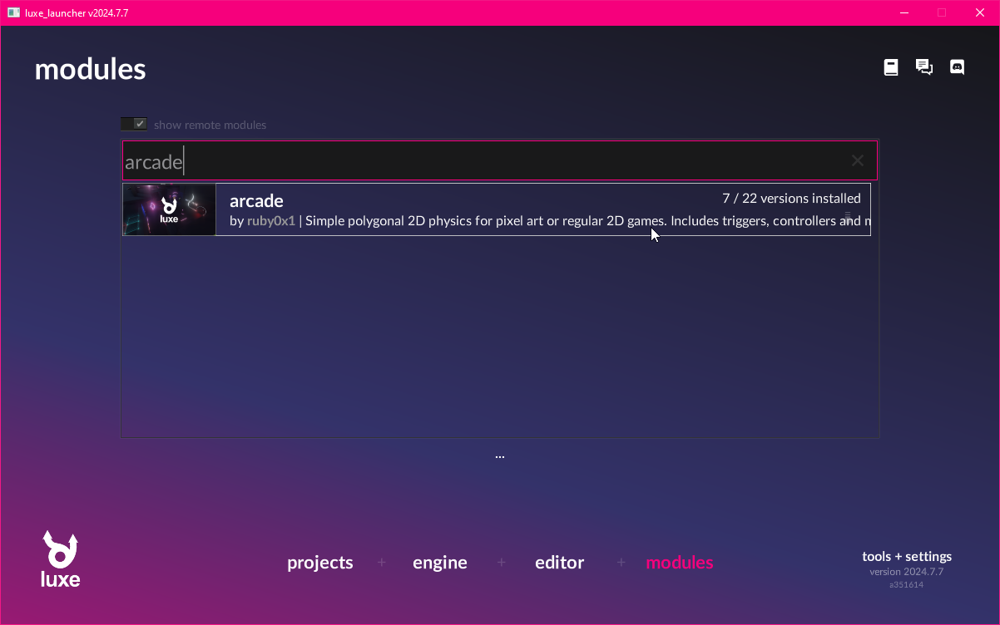
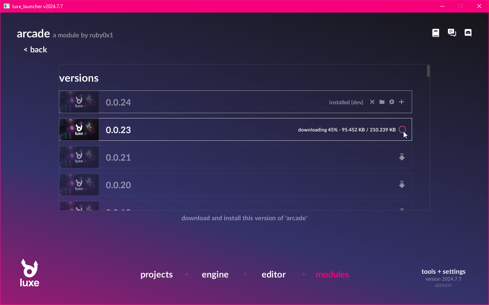
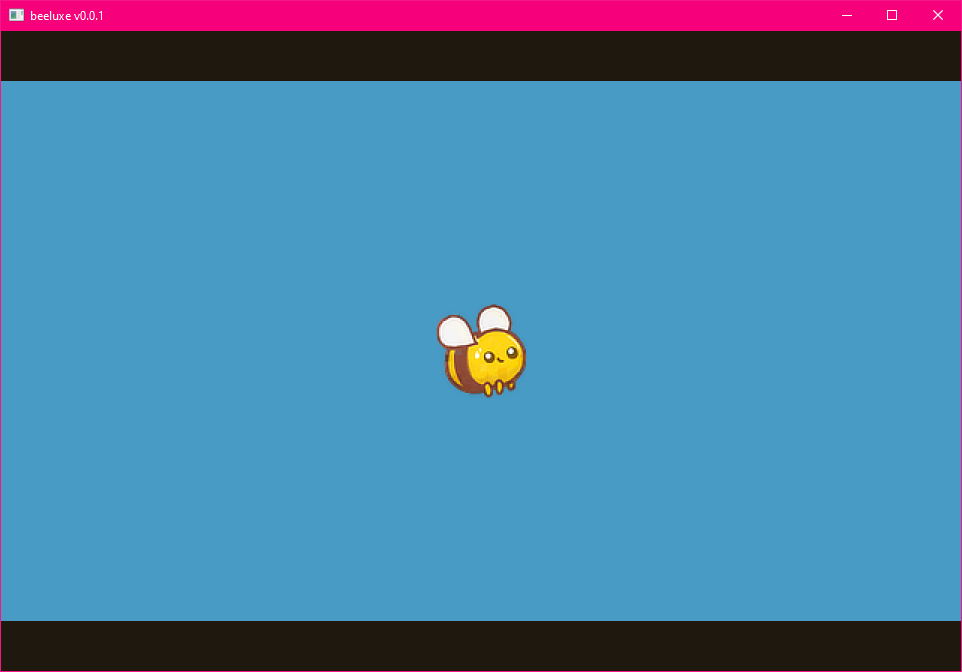
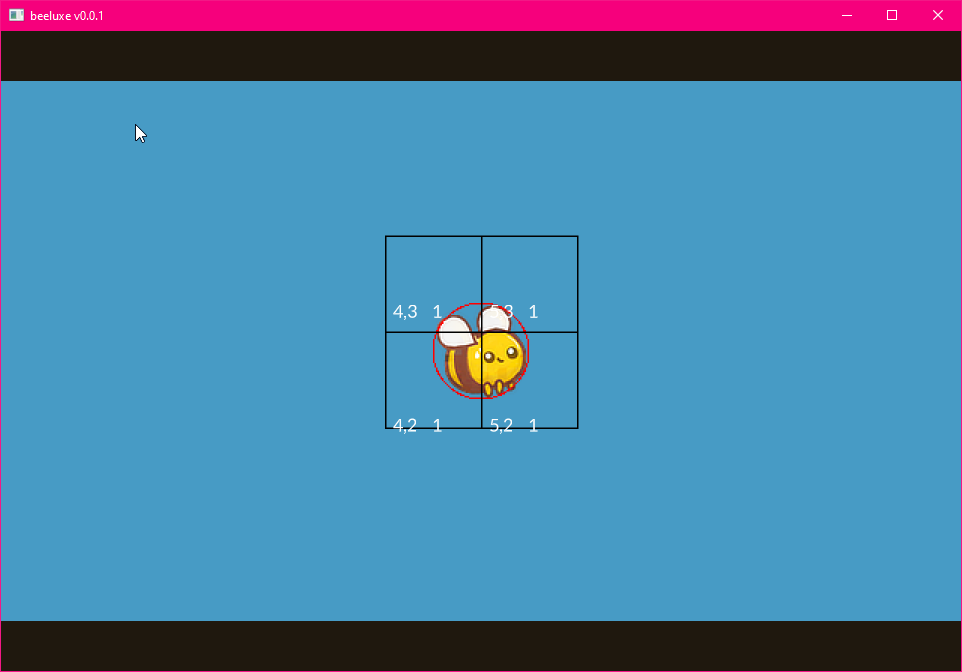
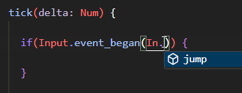
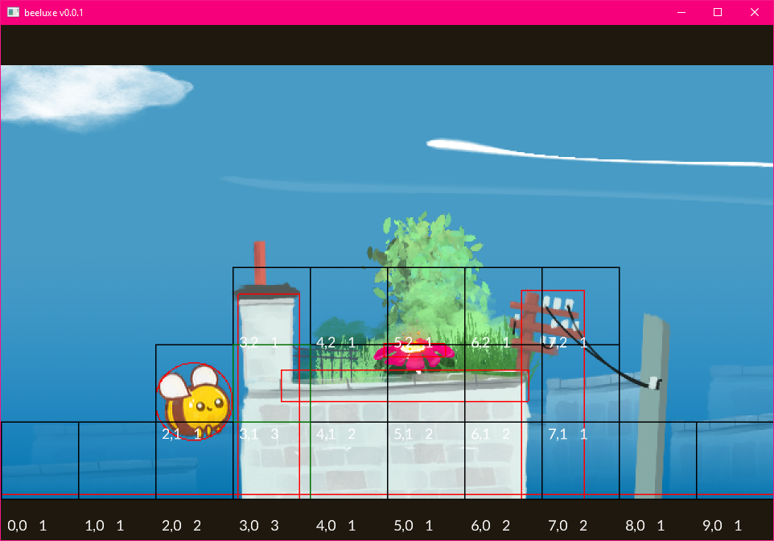
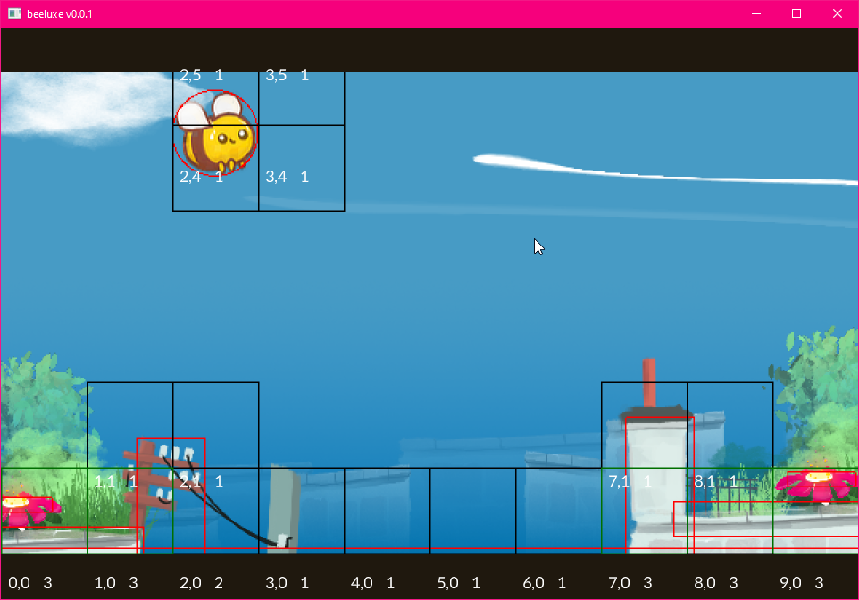

import { Kbd } from 'starlight-kbd/components'
import { Card } from '@astrojs/starlight/components';
import { FileTree } from '@astrojs/starlight/components';

:::tip[Outcome / Goals]{icon="puzzle"}
- In this tutorial we'll **use the World api** to put something on screen
- We'll also use a module, called **Arcade** for handling physics + collision
- We'll load scenes and create prototype instances to populate a world,
and create a custom **Modifier**
:::

We'll make a game where you play as a bee, and have to bounce on flowers!

## Play what we're making

- Click on the game area
- Click to jump, or press <Kbd other="Up"/>/<Kbd other="W"/>/<Kbd other="X"/>/<Kbd other="Space"/> key. 
- Press <Kbd other="R"/> key to reset.

<iframe src="/samples/getting-started/world/index.html" width="100%" height="405px" style="overflow:hidden; display:block; position: relative; border:none; height: 405px !important;">
</iframe>


## Creating the project

For this tutorial, create a new project using the launcher,
and when choosing an outline, **select the tutorial project outline**.
This project is pre-configured so we can dive right in.

:::caution[Start from the correct project outline!]
Create a new project using the **Tutorial Project outline**! Not the empty one!
:::

## Installing a module

In order to run our project, we first need to install a module. If you don't, you'll get errors!

You can use the launcher to install modules. Head over to the module page, and search for the arcade module.
Once you find it, you can click through, and click the download arrow.

The project is configured to use version `0.0.24`, install that version.

:::tip[Do this]{icon="seti:todo"}
Install `arcade` version `0.0.24` to continue!
:::





## Using the module in a project

If you look inside of the `luxe.project/modules.lx` file you'll find the `luxe` and `arcade` modules referenced by version.
You can use the launcher to add a module to the project using the `+` icon, or you can manually add it to this file.

In this case, it's already there from the outline, so let's move on!

## The `Transform` API

In the `Draw` tutorial, we drew a circle in the center of the screen using an immediate style API.

With the world system, we can create things in the world that will continue to draw as long as they're alive.
An Entity in the world can also have modifiers attached that perform logic, and run gameplay code.

:::note[We saw this in the empty project template, right before deleting it!]
:::

To create an entity, we do `Entity.create(world)` - this gives us a blank entity, and is ready to be modified to give it meaning.

The first thing we'll do, is attach a `Transform` modifier. Modifiers use the same `create` pattern,
and some modifiers add `create` functions with convenience arguments, like we'll see below from `Sprite.create`.

Let's create a new `player` variable in our game, and then inside ready we'll create an entity, attach a transform and a sprite to it.

:::note[`world_width/world_height`?]
Since our tutorial outline is based on the pixel outline, we have a fixed world size that will auto scale. This size is set in `outline/settings.settings.lx` and the size of the world is available in `world_width` and `world_height`. This is different from `width`/`height`, which is the window size.
:::

:::tip[Do this]{icon="seti:todo"}
Add the highlighted code to `ready`
:::

```diff lang=js
class Game is Ready {

  var random = Random.new()
  var draw: Draw = null

+  var player = Entity.none

  construct ready() {

    super("ready! %(width) x %(height) @ %(scale)x")

    draw = Draw.create(World.render_set(world))

+    player = Entity.create(world, "player")
+    Transform.create(player, world_width/2, world_height/2)
+    Sprite.create(player, Assets.image("image/bee"), 64, 64)

  } //ready
```

And just like that, we have our player in the middle of the screen.



## Arcade physics

The `arcade` module provides collision + physics for a wide range of games, and comes with a bunch of ready to use tools.

The first important one is the Arcade modifier, which gives an entity a collider shape, and allows you to choose flags like whether it's solid or a trigger, what shape it is, change the velocity and more. It also gives us a callback for when we collide with something, so we can implement a response to overlapping or colliding with something.

### Arcade import

We're gonna use the `Arcade` modifier and some services from the `arcade` module to make our bee interact with the world.

We'll import that module into the top of our `game.wren` code like this:

```js
import "arcade: system/arcade.modifier" for Arcade, CollisionEvent, ShapeType
```

We can see the import part contains `arcade: ` up front. This should be familiar, `luxe: ` imports are from the luxe module! Like `luxe: color` belongs to the luxe module. Imports without a prefix like that, usually belong to the project!

### Attach an arcade modifier

Much like a `Transform` or `Sprite`, we can attach `Arcade` to an entity using the same create pattern.
Let's tidy up and make a `create_player()`  function, and move our player code into it.

:::tip[Do this]{icon = "seti:todo"}
Add the highlighted code changes
:::

```diff lang=js
construct ready() {

  super("ready! %(width) x %(height) @ %(scale)x")

  draw = Draw.create(World.render_set(world))

+  create_player()

} //ready

+create_player() {
+
+  player = Entity.create(world, "player")
+  Transform.create(player, world_width/2, world_height/2)
+  Sprite.create(player, Assets.image("image/bee"), 64, 64)
+
+  Arcade.create(player)
+  Arcade.set_shape_type(player, ShapeType.circle)
+  Arcade.set_radius(player, 32)
+
+}
```

If we run this, it will look identical to before! That's because there's no gravity or anything on our entity.
So how do we know it's working? How do we know the radius matches? We can ask `Arcade` to debug draw the physics state.

:::tip[Do this]{icon = "seti:todo"}
Add the highlighted code changes to `create_player`
:::

```diff lang=js
...
Arcade.set_radius(player, 32)
+Arcade.set_debug_draw_enabled(world, true)
```



Gravity is a constant acceleration, so we can use the `Arcade.set_acc` tool to add a downward acceleration.
The value is relative to your world size, and is game specific. For this game, we'll pick `-200` as that feels good.
You can make it whatever you want!

:::tip[Do this]{icon = "seti:todo"}
Add the highlighted code changes to `create_player`
:::

```diff lang=js
...
Arcade.set_radius(player, 32)
+Arcade.set_acc(player, [0, -200])
Arcade.set_debug_draw_enabled(world, true)
```

If you run this now, you should see the bee falling off the bottom of the world!

<video preload="auto" autoplay controls muted playinsline loop="loop" style="max-width:100%; width:auto; margin:auto; display:block;">
  <source src="/video/getting-started/world/arcade.2.mp4" type="video/mp4"></source>
</video>

## Loading a scene

Our outline includes a scene that has been created for us. This scene includes some background details, and a floor collider which will keep our bee on screen.

A scene is a kind of data based asset, a container for pre-configured entities with their modifiers already attached.

A particular scene can only be loaded once into the same world, but you can load multiple scenes into the same world.
This makes them useful as a tool to layer or keep things loaded in the world, and much more. Scenes are typically what you would use for stuff like a Menu, or Level based games.

:::note[Scene assets]
Scenes are typically created with the luxe editor, but they're simple data inside of a folder.
Take a look inside the `scene/level.scene/` folder, and look inside any `.entity.lx` file!
:::

With `Scene.create` we can load a scene from an asset. We'll use the `Asset.scene(id)` to grab the asset handle of the scene.

:::note[Work In Progress Asset API]
The `Scene` API is available via `import "luxe: world/scene" for Scene` and is imported already.

Some assets, like the image above, use the older `Assets.image(id)` API (plural), while the scene and newer assets use `Asset.scene(id)` API (singular). The reason both exist is because we're moving to the new system and some assets aren't done moving yet.
:::

Just before we create our player, we'll load our level scene into the world.

:::tip[Do this]{icon = "seti:todo"}
Add the highlighted line in `ready`, inside `game.wren`
:::

```diff lang=js
construct ready() {

  super("ready! %(width) x %(height) @ %(scale)x")

  draw = Draw.create(World.render_set(world))

+  Scene.create(world, Asset.scene("scene/level"))

  create_player()

} //ready
```

With that, we'll see the clouds, some buildings, a gradient and we'll see the floor collider. The bee will bounce off the floor, and we're ready for the next step.

<video preload="auto" autoplay controls muted playinsline loop="loop" style="max-width:100%; width:auto; margin:auto; display:block;">
  <source src="/video/getting-started/world/arcade.3.mp4" type="video/mp4"></source>
</video>

## Named input events

In the first tutorial, we used `Input.key_state_released` to directly query a key.
This is great for quick prototypes but doesn't allow multiple keys, gamepads, or mouse inputs easily.

For that we'll need to use **named input events**. A named input event is what it sounds like, a name assigned to one or more inputs!
We have a few of these already defined by our project, if you look inside of `outline/inputs.input.lx` you'll see this:

```js
jump = {
  keys = ["key_x", "up", "key_w", "space"]
  mouse = ["left"]
  gamepad = [0]
}
```

If we query this instead of the individual key, any of those inputs will trigger the event.
Since these are named events we refer to them by a string value, "jump", but using strings all over
our project can lead to code that can be difficult to change.

Instead, what we'll do is make an enum-like class that makes our code easier to use, and gives us code completion and errors if we spell it wrong. The pattern is a static function that returns a string, so we'll make one called `In` and a function called `jump`, so we can use `In.jump` to refer to the event name.



```diff lang=js
+class In {
+  static jump { "jump" }
+}

class Game is Ready {
...
```

## Implementing jump

Now inside our game class in `game.wren`, we'll add a jump function to make the bee jump. 

**We call this inside the tick function**.

To do that, we'll get the current bee velocity, add to it, and then re-apply it. We'll also set the x (horizontal) velocity to 0, because we never want the bee to move horizontally in this game.

```diff lang=js
+jump() {
+
+  var velocity = Arcade.get_vel(player)
+
+  velocity.x = 0
+  velocity.y = velocity.y + 150
+
+  Arcade.set_vel(player, velocity)
+
+} //jump

tick(delta: Num) {

+  if(Input.event_began(In.jump)) {
+    jump()
+  }

...
```

Now when we run the game and press <Kbd other="Up"/>/<Kbd other="W"/>/<Kbd other="X"/>/<Kbd other="Space"/> the bee will jump upward. 
<video preload="auto" autoplay controls muted playinsline loop="loop" style="max-width:100%; width:auto; margin:auto; display:block;">
  <source src="/video/getting-started/world/arcade.4.mp4" type="video/mp4"></source>
</video>

## Player position and speed

The bee jump is a little easy to go off screen, so we'll make a minor change to `create_player()` to give them a max speed, and we'll also enforce that the bee is always in the same position on screen, about a quarter of the way in.

```diff lang=js
create_player() {

  ...

  Arcade.set_acc(player, [0, -200])
+  Arcade.set_max_speed(player, 150)
  Arcade.set_debug_draw_enabled(world, true)

}
```

Inside `tick`, we'll set the player position to `world_width / 4` every frame.

```diff lang=js
tick(delta: Num) {

+  Transform.set_pos_x(player, world_width / 4)

  ...

```

Now when we play, we have a couple jumps before we leave the screen, and our bee is in a nice place for the game.

<video preload="auto" autoplay controls muted playinsline loop="loop" style="max-width:100%; width:auto; margin:auto; display:block;">
  <source src="/video/getting-started/world/arcade.5.mp4" type="video/mp4"></source>
</video>

## Create a Prototype instance

Prototypes are similar to a `Scene`, in that they are a bundle entities, already set up with their modifiers, ready to create!

:::note[Prototype vs Scene]
Prototypes are not limited to one per world like scenes. You can create many **instances** of the same prototype in the world.

They can be created from code, like we will below, or they can be placed inside a scene. They can also be placed inside of other prototypes! Each instance can have the values from the prototype overridden when placed that way, making it unique.
:::

Our project includes a pillar ready to go as `prototype/pillar.0` (we'll make more with the luxe editor in the next tutorial).

We'll create a `create_pillar` function, and we'll call it right after creating the player.
To create a prototype we use `Prototype.create` and `Asset.prototype` similarly. This returns a single entity, 
which allows us to move or manage the whole bundle of things it created as a single unit.

```diff lang=js
  ...
  create_player()
+  create_pillar()

} //ready

+create_pillar() {
+
+  var pillar = Prototype.create(world, Asset.prototype("prototype/pillar.0"))
+  Transform.set_scale(pillar, 0.4, 0.4)
+  Transform.set_pos(pillar, world_width / 2, random.int(15, 170))
+
+} //create_pillar
```

With that, you should see a pillar spawned in the center of the world.



## Creating a custom modifier

The next step is to move the pillars across the screen, so the player will have to jump over them.

To do that, we want to make a modifier that will move any pillar that it is attached to, and when the pillar moves off the left of the screen, clean itself up.

### `system/` folder convention 

The convention for modifiers is to be in a folder called `system/`.
Each modifier is a `wren` file with a `.modifier.wren` extension. The `.modifier.` part is what luxe calls a 'subtype'. You'll see that on most assets!

:::tip[Do this]{icon = "seti:todo"}
Create a new empty folder called system/ in the project
:::

<FileTree>
- ...
- luxe.project/
- outline/
- **system/** add a new empty folder in the project root
- game.wren
- project.luxe
</FileTree>

### Generating code for you

When we want to make a new modifier, it's convenient for the engine to fill in the code to get started.
Luxe will do that for us, if we create a blank file named with the `.modifier.wren` ending it can fill in the blank file for us.

:::tip[Do this]{icon = "seti:todo"}
Create an empty file called `system/pillar.modifier.wren` in the project
:::

<FileTree>
- ...
- luxe.project/
- outline/
- system/
  - **pillar.modifier.wren** add a new empty file inside the system folder
- game.wren
- project.luxe
</FileTree>

At the moment, it will only fill in that file for us *when we build*.
So **run a build** from the code editor, and watch that file get filled out. 

:::tip[Do this]{icon = "seti:todo"}
Run the build to fill in the blank file.
:::

### Update the generated meta data

Look for the API part of our newly generated code. It has some placeholder details we should change.

```js del="EmptyModifier" del="Empty Modifier" del="A new modifier" del="You should update this description" del="luxe: image/modifier/modifier.svg"
#api
#display = "Empty Modifier"
#desc = "**A new modifier**. You should update this description" 
#icon = "luxe: image/modifier/modifier.svg"
class EmptyModifier is API {
  //add public facing API here
}
```

We can update it to look like this:

```js ins="Pillar" ins="A moving pillar" ins="Moves the pillar horizontally toward the player, then removes itself when offscreen" ins="image/pillar.svg"
#api
#display = "Pillar"
#desc = "**A moving pillar**. Moves the pillar horizontally toward the player, then removes itself when offscreen."
#icon = "image/pillar.svg"
class Pillar is API {
```

:::note[There's a more detailed guide on [custom modifiers](../../learn/modifiers/custom-modifiers.md) here]
:::

### Attach the modifier

Now that we have a modifier, we can use it similar to a luxe modifier. We first import it, which we can see is now from the project, not from a module.

:::tip[Do this]{icon = "seti:todo"}
Add `import "system/pillar.modifier" for Pillar` at the top of `game.wren`.
:::

Now that we have a modifier, we can attach it in the same way that we do for the built in ones.
We'll also modify our start position for the pillar, by setting it to `world_width + 128` instead.

```diff lang=js ins="world_width + 128"
import "system/pillar.modifier" for Pillar
...
create_pillar() {

  var pillar = Prototype.create(world, Asset.prototype("prototype/pillar.0"))
  Transform.set_scale(pillar, 0.4, 0.4)
  Transform.set_pos(pillar, world_width + 128, random.int(15, 170))
+  Pillar.create(pillar)

} //create_pillar
```

When you run this, you'll also see the line in the log because of the code in `attach`:

```js
[system/pillar.modifier line 29] - attached to `prototype/pillar.0` `42951770139`
```

You also won't see the pillar since we put it off screen! So let's make it move so we can.

## Moving the pillars

Inside our `pillar.modifier.wren` there's a `Data` class, which was empty at the time.
For our pillar to move, we'll need a speed value and we can store the speed value in this class.

The data class is **per entity data**, so if we want to store some value for each entity that our modifier is attached to, this is where we can put it.
This means each pillar can choose to move at a different speed, because each entity has it's own value for speed.

:::tip[Do this]{icon="seti:todo"}
Add a `speed` variable like this with a default value of `100`:
:::

```diff lang=js
class Data {
+  var speed: Num = 100
}
```

:::note
This Data class is a special type of class, and isn't a normal Wren class. You can't make an instance of it and such.
The fields* require* a type definition, and often have extra tags to configure how the data works.
:::

Now we can use the `tick` function of our new modifier, to move our pillar. 
Once it goes off screen, we can destroy the pillar so it doesn't exist when no longer relevant.

Inside the tick function of our modifier, we can use the `each` helper to do something on each instance of our modifier.
This is a lot like a for loop, except we get to do a chunk of code for every entity. It also hands us the `Data` for each unique one!

:::tip[Do this]{icon="seti:todo"}
The each helper is there and commented out, but we'll uncomment it and add the highlighted lines
:::

```diff lang=js
tick(delta: Num) {
+  each {|entity: Entity, pillar: Data|
+
+    var x_now = Transform.get_pos_x(entity) - pillar.speed * delta
+    Transform.set_pos_x(entity, x_now)
+
+    if(x_now < -256) {
+      Frame.end { Entity.destroy(entity) }
+    }
+
+  } //each
} //tick
```

So: for every pillar in the world, move it to the side, using it's own speed. If it goes off screen, we can destroy it.
When the pillar goes off screen, we should see this in the log, because of the code inside `detach`.

```js
[system/pillar.modifier line 34] - detached from `prototype/pillar.0` `42951770139`
```

:::note
The `Frame.end {}` runs a function at the end of the frame. This is a WIP requirement for this `Entity.destroy`
:::

<video preload="auto" autoplay controls muted playinsline loop="loop" style="max-width:100%; width:auto; margin:auto; display:block;">
  <source src="/video/getting-started/world/modifier.1.mp4" type="video/mp4"></source>
</video>

## More pillars

:::tip[We're back inside of `game.wren`]
:::

We probably want more than one pillar to come across the level, so we'll use a tool called `World.schedule(world, time, fn)`. 

This calls a function for us every `time` seconds, but the important part is that it is affected by the world rate.

:::note
If we used `Frame.schedule(time, fn)` it would be global, and not world specific. With `World.schedule` we can pause by setting the world rate to 0.
:::

```diff lang=js

  ...
  ... //existing code
  create_player()

  create_pillar()
+  World.schedule(world, 6, 9999) {
+    create_pillar()
+  }

} //ready
```

And with that change, we now get a constant stream of pillars to jump over! We have one more important thing to do to finish this tutorial.



## Handling collision

Our last step for this game is handling what happens when you hit something.

If you saw the moving pillar video above, the player goes through the walls and keeps jumping forward because of our code to keep it in the same spot.

Instead what we'll do is check the direction of the hit, and if you hit a wall (sideways), pause the game world. The direction check is using a math function called the dot product. 

:::note[Dot product as a direction check? What is the dot product...]
We don't really have to dig too deep right now, `Math.dot` returns `< 0` if something is behind us, and `> 0` if it's in front. It also tells us just how much it is in front, between 0 and 1. 1 being directly in front, 0 being to the side!
:::

:::tip[Do this]{icon="seti:todo"}
Add the following code inside `ready` and after `ready`.
:::

```diff lang=js
  ...

+  handle_collision()

} //ready

+handle_collision() {
+
+  Arcade.add_collision_callback(player) {|entity_a, entity_b, state, normal, dist|
+    if(state != CollisionEvent.begin) return
+
+    var dot = Math.dot2D(normal, [0,1,0])
+
+    if(dot.abs < 0.8) {
+      World.set_rate(world, 0)
+    }
+
+  } //collision callback
+
+} //handle_collision
```

You can see here we bounce off the top of things, but when we hit the side wall, we stop.

<video preload="auto" autoplay controls muted playinsline loop="loop" style="max-width:100%; width:auto; margin:auto; display:block;">
  <source src="/video/getting-started/world/collision.1.mp4" type="video/mp4"></source>
</video>

## Polishing

The collision check is a little abrupt, and isn't very fun because it's super precise and you can fail easily.

To make the game a bit more fun, we'll add some squishy behaviour. 

:::note
Often when learning through tutorials, you'll encounter things we don't yet fully understand. It's ok to just copy the code example here to improve the experience!
:::

When we hit a collider, we get the height and check the distance. If the distance is less than 32 (half the radius of our bee), we've just hit the edge of the collider with the bottom of the bee and we can ignore it.

Another tweak, we'll **play a bounce animation** when we hit a flower. This also uses the `Tags` modifier, which allows us to tag entities with specific tags and check for them. In this case, our flower entity inside the pillar prototype already has a tag.

```diff lang=js ins=" && dist > 32"
handle_collision() {

  Arcade.add_collision_callback(player) {|entity_a, entity_b, state, normal, overlap_dist|
    if(state != CollisionEvent.begin) return

    var dot = Math.dot2D(normal, [0,1,0])

+    var scale = Transform.get_scale_world(entity_b)
+    var height = Arcade.get_height(entity_b) * scale.y
+    var top = Transform.get_pos_y_world(entity_b) + (height * 0.5)
+    var dist = (top - (Transform.get_pos_y_world(player) - 32))

    if(dot.abs < 0.8 && dist > 32) {
      World.set_rate(world, 0)
    }

+    if(Tags.has_tag(entity_b, "flower")) {
+      Anim.play(entity_b, "anim/bounce")
+    }

  } //collision callback

} //handle_collision
```

<video preload="auto" autoplay controls muted playinsline loop="loop" style="max-width:100%; width:auto; margin:auto; display:block;">
  <source src="/video/getting-started/world/collision.2.mp4" type="video/mp4"></source>
</video>

## Reset

One final task is to make it so you can reset the state so you can try again.

We'll add a `reset()` function, first we reset the player position, and unpause the world.
This is called from tick using a simple key check.

```diff lang=js
+reset() {
+  Transform.set_pos(player, world_width/4, world_height/2, 0)
+  World.set_rate(world, 1)
+}

tick(delta: Num) {

+  if(Input.key_state_released(Key.key_r)) {
+    reset()
+  }

  ...
```

Now, our pillars will still be there, so we'll need to clear them up too!

:::tip[We're now inside of `pillar.modifier.wren`]{icon="information"}
:::

We could keep a list of pillars we created, and then clean them up like we did in the draw tutorial...

But the modifer system we created already knows about all of our pillars! It keeps track for us.

Let's add a public API to our pillar modifier, e.g `Pillar.reset(world)`.

To do this, we'll add a function to the `API` class in our modifier. This function has access to a helper function called `system_in`, which gives us our system to call into.

```diff lang=js
class Pillar is API {

+  static reset(world: World) {
+    var system: System = system_in(world)
+    system.reset()
+  }

}
```

Now inside of our system, we can add the reset function. This function will simply loop through each pillar, and destroy it.

```diff lang=js
class System is Modifier {

  ...

+  reset() {
+    each {|entity: Entity, pillar: Data|
+      Frame.end { Entity.destroy(entity) }
+    }
+  }

```

And of course, don't forget to call it from our reset function:

```diff lang=js
reset() {
+  Pillar.reset(world)
  Transform.set_pos(player, world_width/4, world_height/2, 0)
  World.set_rate(world, 1)
}
```

## Debug off

One more tweak, now that we know it is working: turn off the debug drawer! We use a comment to disable the single line of code that set the debug drawing to active.

```js
// Arcade.set_debug_draw_enabled(world, true)
```

<video preload="auto" autoplay controls muted playinsline loop="loop" style="max-width:100%; width:auto; margin:auto; display:block;">
  <source src="/video/getting-started/world/final.mp4" type="video/mp4"></source>
</video>

## Try this


<Card title="Add score" icon="up-arrow">
Add a `score` variable to the game class, add `1` to it each time a flower is collected.
</Card>

<Card title="Add game over" icon="moon">
Like before, make the experience more complete.
</Card>

<Card title="Experiment with values" icon="random">
    Try randomizing pillar speeds, pillar schedule timing, bee velocities and more.
</Card>

## Final code

### `game.wren`

```js
import "luxe: world" for World, Entity, Transform, Sprite, Tags, Anim
import "luxe: draw" for Draw, PathStyle
import "luxe: render" for Material
import "luxe: game" for Frame
import "luxe: input" for Input, Key
import "luxe: assets" for Assets, Strings
import "luxe: asset" for Asset
import "luxe: math" for Math
import "luxe: string" for Str
import "luxe: io" for IO
import "random" for Random

import "luxe: world/scene" for Scene
import "luxe: world/prototype" for Prototype
import "arcade: system/arcade.modifier" for Arcade, CollisionEvent, ShapeType
import "system/pillar.modifier" for Pillar

import "outline/ready" for Ready

class In {
  static jump { "jump" }
}

class Game is Ready {

  var random = Random.new()
  var draw: Draw = null

  var player = Entity.none

  construct ready() {

    super("ready! %(width) x %(height) @ %(scale)x")

    draw = Draw.create(World.render_set(world))

    Scene.create(world, Asset.scene("scene/level"))
    create_player()

    create_pillar()
    World.schedule(world, 6, 9999) {
      create_pillar()
    }

    handle_collision()

  } //ready

  handle_collision() {

    Arcade.add_collision_callback(player) {|entity_a, entity_b, state, normal, overlap_dist|
      if(state != CollisionEvent.begin) return

      var dot = Math.dot2D(normal, [0,1,0])

      var scale = Transform.get_scale_world(entity_b)
      var height = Arcade.get_height(entity_b) * scale.y
      var top = Transform.get_pos_y_world(entity_b) + (height * 0.5)
      var dist = (top - (Transform.get_pos_y_world(player) - 32))

      if(dot.abs < 0.8 && dist > 32) {
        World.set_rate(world, 0)
      }

      if(Tags.has_tag(entity_b, "flower")) {
        Anim.play(entity_b, "anim/bounce")
      }

    } //collision callback

  } //handle_collision

  create_player() {

    player = Entity.create(world, "player")
    Transform.create(player, world_width/2, world_height/2)
    Sprite.create(player, Assets.image("image/bee"), 64, 64)

    Arcade.create(player)
    Arcade.set_shape_type(player, ShapeType.circle)
    Arcade.set_radius(player, 32)
    Arcade.set_acc(player, [0, -200])
    Arcade.set_max_speed(player, 150)
    // Arcade.set_debug_draw_enabled(world, true)

  } //create_player

  create_pillar() {

    var pillar = Prototype.create(world, Asset.prototype("prototype/pillar.0"))
    Transform.set_scale(pillar, 0.4, 0.4)
    Transform.set_pos(pillar, world_width + 128, random.int(15, 170))
    Pillar.create(pillar)

  } //create_pillar

  jump() {

    var velocity = Arcade.get_vel(player)

    velocity.x = 0
    velocity.y = velocity.y + 150

    Arcade.set_vel(player, velocity)

  } //jump

  reset() {
    Pillar.reset(world)
    Transform.set_pos(player, world_width/4, world_height/2, 0)
    World.set_rate(world, 1)
  }

  tick(delta: Num) {

    if(Input.key_state_released(Key.key_r)) {
      reset()
    }

    Transform.set_pos_x(player, world_width / 4)

    if(Input.event_began(In.jump)) {
      jump()
    }

    if(Input.key_state_released(Key.escape)) {
      IO.shutdown()
    }

  } //tick

} //Game
```

### `system/pillar.modifier.wren`

```js
import "system/pillar.modifier.api" for API, Modifier, APIGet, APISet
import "luxe: world" for Entity, Transform
import "luxe: render" for Render, Geometry
import "luxe.project/asset" for Asset
import "luxe: assets" for Strings
import "luxe: game" for Frame

#block = data
class Data {
  var speed: Num = 100
}

#api
#icon = "image/pillar.svg"
#display = "Pillar"
#desc = "**A moving pillar**. Moves the pillar horizontally toward the player, then removes itself when offscreen."
class Pillar is API {

  static reset(world: World) {
    var system: System = system_in(world)
    system.reset()
  }

}

#system
#phase(on, tick)
class System is Modifier {

  init(world: World) {
    Log.print("init `%(This)` in world `%(world)`")
  }

  attach(entity: Entity, pillar: Data) {
    Log.print("attached to `%(Strings.get(Entity.get_name(entity)))` `%(entity)`")
  }

  detach(entity: Entity, pillar: Data) {
    Log.print("detached from `%(Strings.get(Entity.get_name(entity)))` `%(entity)`")
  }

  reset() {
    each {|entity: Entity, pillar: Data|
      Frame.end { Entity.destroy(entity) }
    }
  }

  tick(delta: Num) {
    each {|entity: Entity, pillar: Data|

      var x_now = Transform.get_pos_x(entity) - pillar.speed * delta
      Transform.set_pos_x(entity, x_now)

      if(x_now < -256) {
        Frame.end { Entity.destroy(entity) }
      }

    } //each
  } //tick

}
```
