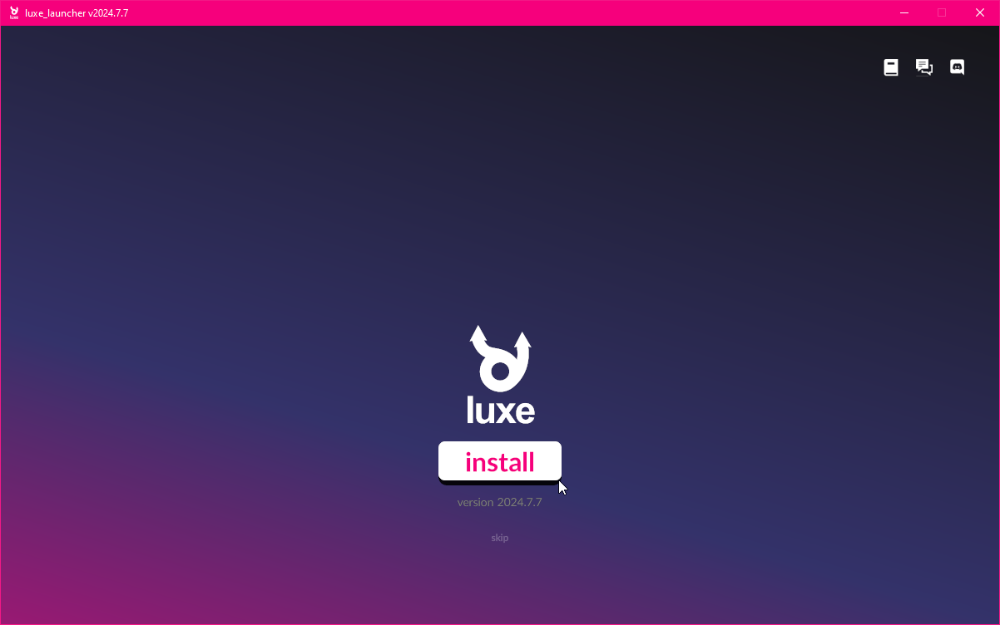
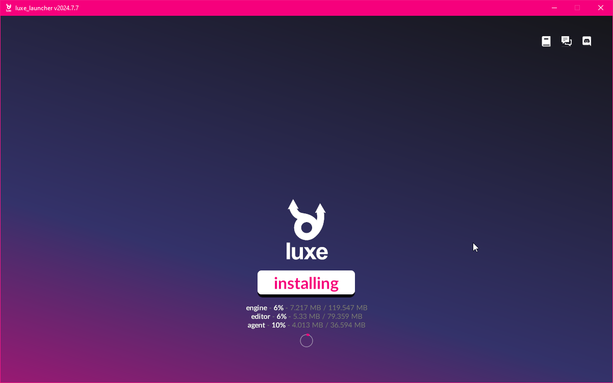
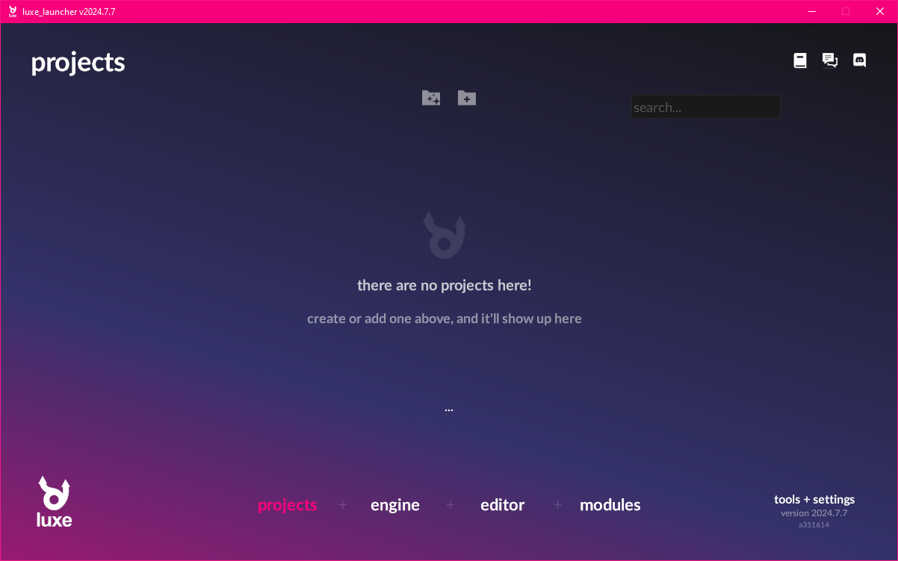
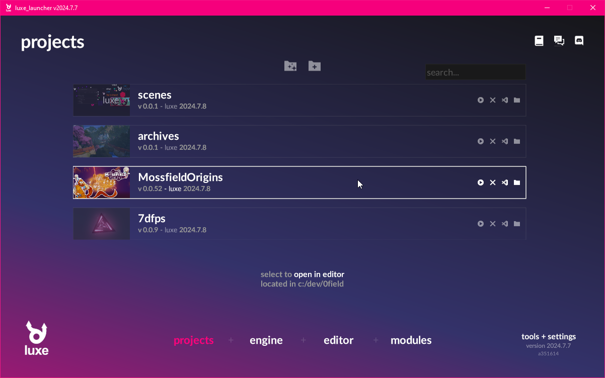
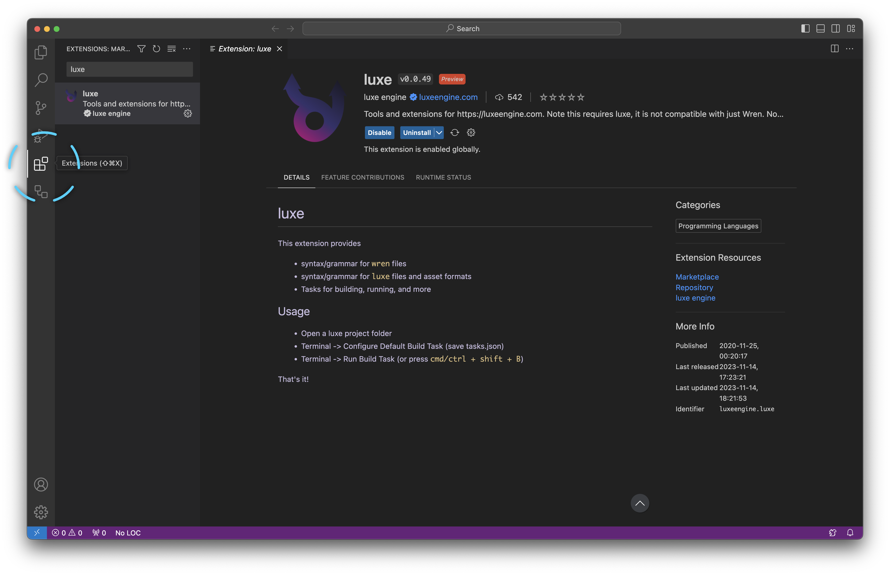

Below we'll get the pieces we need to work with luxe.

:::tip[All steps!]{icon="approve-check-circle"}
Make sure to read both sections below before continuing!
:::

## Download the luxe launcher

- [Get the luxe launcher](https://luxeengine.com/get)
- Run the launcher, it'll offer to install the latest version
- This will install the engine, editor and agent

- Progress will be shown under the install button
  

- After installing, you should see this
  

- Once you've created or added projects, it will look like this

## Installing code editor support

Currently the primary supported code editor is [Visual Studio Code](https://code.visualstudio.com/).   

It's a free cross platform editor with great support for custom extensions.
The extension includes features like code completion, jump to definition, and so on.

:::note[Install Visual Studio Code]
Download and install Visual Studio Code from the above link if you don't have it.
:::

To install support for luxe, open the extensions panel. 
This is an icon on the side bar, or found via the `View -> Extensions` menu.  

Search the extensions for 'luxe' and when found, select 'install'.   
_(Make sure it's the official one)_. [View the extension in the marketplace.](https://marketplace.visualstudio.com/items?itemName=luxeengine.luxe).

